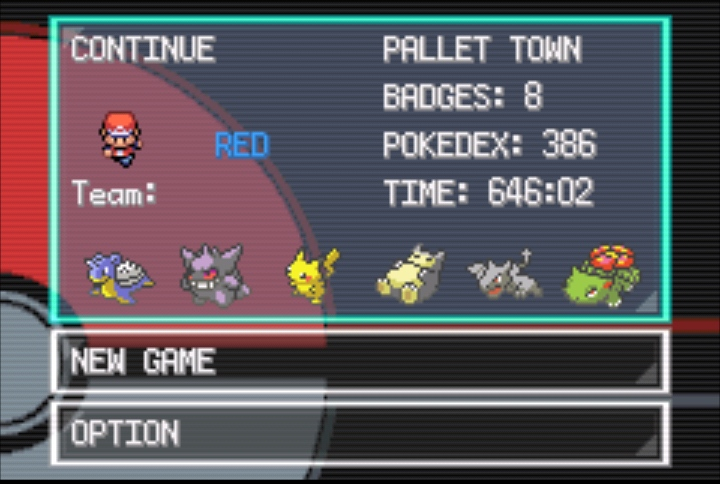

To support this types of codes and coders join our discord https://discord.com/invite/axNX3rhR9K
# Continue screen-BW
A C injection for inserting a new  continue screen from Pokemon B/W to BPRE(firered). This code is taken from a pokefirered rom hack.
#Screenshot:

## Credits : ansh860, Shiny-Miner, Compumaxx
***Notes:*** 
- DevkitARM and ARMIPS are required. - To compile it is necessary to have preproc.exe and gbagfx.exe within some path of the PATH variable
- Open the config.mk file, find and change fa0000 of the following line to an offset aligned with enough free space: `INSERT_INTO ?= 0x08fa0000
- Name your rom/rom to insert the code BPRE0.gba and put it in the folder
- Compile by running make with your terminal, and a rom with the injection will appear in a folder called `build`.
- Files inside the `include` folder were taken from [**pokefirered**](https://github.com/pret/pokefirered)..
 # Fix for missing msvcp140.dll

 If your program gives error like this then add the .dll file downloaded from this link to the armips folder. 
 https://login.microsoftonline.com/common/oauth2/v2.0/authorize?client_id=a81d90ac-aa75-4cf8-b14c-58bf348528fe&redirect_uri=https%3A%2F%2Fanswers.microsoft.com&response_type=code%20id_token&scope=openid%20profile&state=OpenIdConnect.AuthenticationProperties%3DaUSSLmdf1ul0BdJwbQkD2gNFU7c0mxBAX4SdJTVVlBE4zOcYVRMFxHHDh23cQKuM4bhOTtO1uEbuCfYc2nRzSu_6uOA3swOev_9AXJSF10AAQIt6lYFdO2hOgD5LzIuoPq0AvDGFNSjjNmjZPmjC1GZJUwvwECzgWjnB4cTDMYDSzXntFKK69u9F9p872d-M9EPFRdD-vHg3ogUW6p1oz5wuKgYVRZJZc8nZGBjzga77Kk6yRsm_wdlsg_u5L66gORv0wD-gexIh3pZ6mSmFBqjQQkPnWQOZNZ-QXxRoTWupYEUrzhyKkDXdukNQxPyXblYdijijdc-0UY-drKZSsg&response_mode=form_post&nonce=638575835974040108.YjQ4ZGI3MDQtOTJkZi00YTg4LWEwZDUtMTBjMTlmY2E2ODhhZDRmODEzMGItZDljNC00MDkyLWIwMDQtMzMxOTE3NmQ2NTUx&nopa=2&prompt=none&x-client-SKU=ID_NET472&x-client-ver=7.6.0.0
