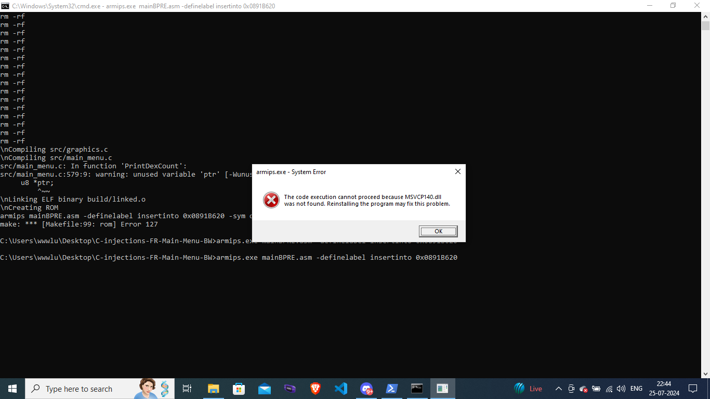

To support this types of codes and coders join our discord https://discord.com/invite/axNX3rhR9K
# Continue screen-BW
A C injection for inserting a new  continue screen from Pokemon HG/SS to BPRE(firered). This code is taken from a pokefirered rom hack.
#Screenshot:

## Credits : Shiny-Miner, Compumaxx (BW one used as base)
***Notes:*** 
- DevkitARM and ARMIPS are required. - To compile it is necessary to have preproc.exe and gbagfx.exe within some path of the PATH variable
- Open the config.mk file, find and change fa0000 of the following line to an offset aligned with enough free space: `INSERT_INTO ?= 0x08fa0000
- Name your rom/rom to insert the code BPRE0.gba and put it in the folder
- Compile by running make with your terminal, and a rom with the injection will appear in a folder called `build`.
- Files inside the `include` folder were taken from [**pokefirered**](https://github.com/pret/pokefirered)..
 # Fix for missing msvcp140.dll

 If your program gives error like this then you need to Install Microsoft Visual C++ Redistributable for Visual Studio 2015 from here
 https://www.microsoft.com/en-ca/download/details.aspx?id=48145
 After installing retry compiling the code if it doesn't compile then restarting the pc should fix that.
 
 Credits for fix - LuckY (discord)
